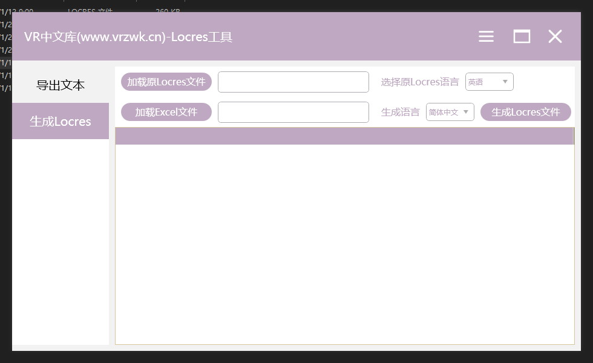
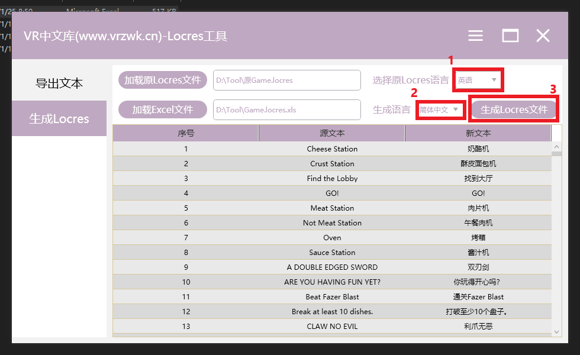
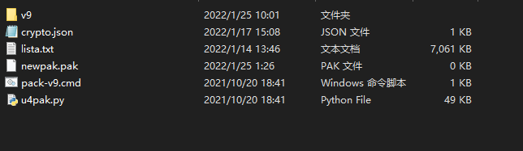
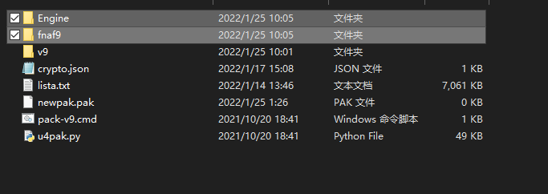
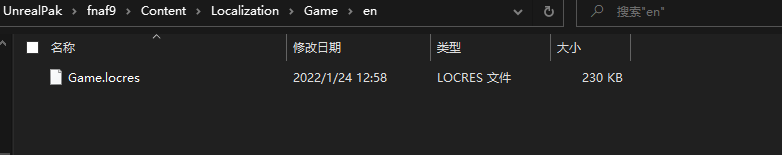
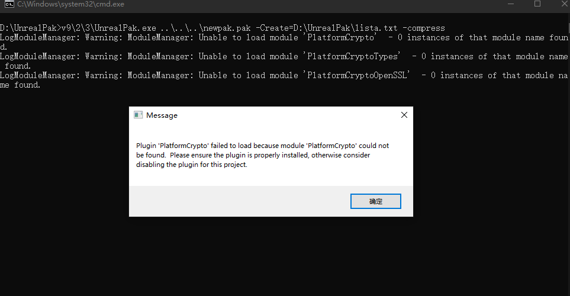
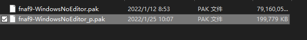

# FNAF-SecurityBreach_Chinese
玩具熊的五夜后宫：安全漏洞中文汉化补丁  
This patch can transfer your English language pack of FNAF:Security Breach into Chinese.  

## 汉化补丁 [FNAF:SB_汉化安装程序v3.5](https://github.com/HanFengRuYue/FNAF-SecurityBreach_Chinese/releases/download/Install_v3.5/Fnaf-Security.Breach-Chinese.Patch.exe)  

## 游戏汉化文本 [Games.locres.xls](src/Game.locres.xls)  

## 制作汉化补丁：(此为制作汉化的教程！不是汉化补丁！不是汉化补丁！汉化补丁请下载汉化补丁安装程序！)

### 1、使用locres工具将xls文本打包成locres文本

第一步：locres工具从这个网站下载

`https://vrzwk.cn/366.html`

第二步：打开工具点击左栏 `生成locres`

第三步：点击上方 `加载原locres文件` 导入英文文本[EN_Game.locres](src/EN_Game.locres) 

第四步：先将 `生成语言` 改为 `简体中文` ，然后再点击 `加载Excel文件` 将已汉化或修改的文件导入[Game.locres.xls](src/Game.locres.xls) 

第五步：最后点击`生成locres文件`保存locres文件

 

### 2、将locres文件打包回pak文件

第一步：下载UnrealPak来进行打包 

[UnrealPak](program/UnrealPak.zip) 

该压缩包里的UnrealPak已设置好

注意！UnrealPak工具可能需要安装Python：

`https://www.python.org/ftp/python/3.9.0/python-3.9.0-amd64.exe`

第二步：解开压缩包

 

第三步：将游戏解包出来的文件复制到UnrealPak文件夹里

游戏请自行解包，不再提供  

 

第四步：将生成出来的locres文件复制到这个目录

`UnrealPak\fnaf9\Content\Localization\Game\en`

并将原来的 `Game.locres` 删掉，然后将复制进来的locres改为 `Game.locres`

第五步：将UnrealPak文件夹里的 `lista.txt` 文件拖拽到 `pack-v9.cmd` 上，程序会开始打包

开始会提示组件缺失按确定就好

第六步：打包完成之后得到 `newpak.pak` 将它复制到游戏目录的 `Quarters\fnaf9\Content\Paks`这

第七步：将 `newpak.pak` 改为 `fnaf9-WindowsNoEditor_p.pak` 完成，运行游戏即可

